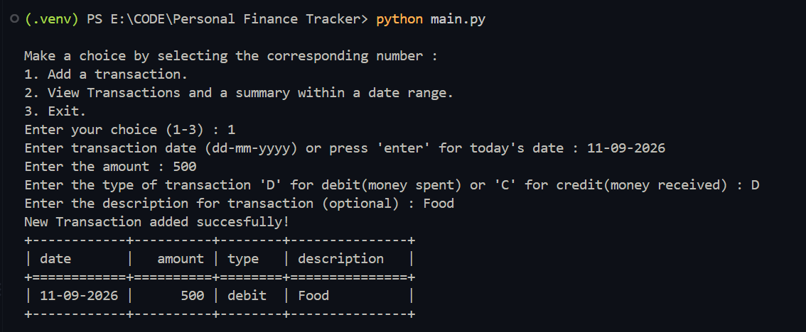
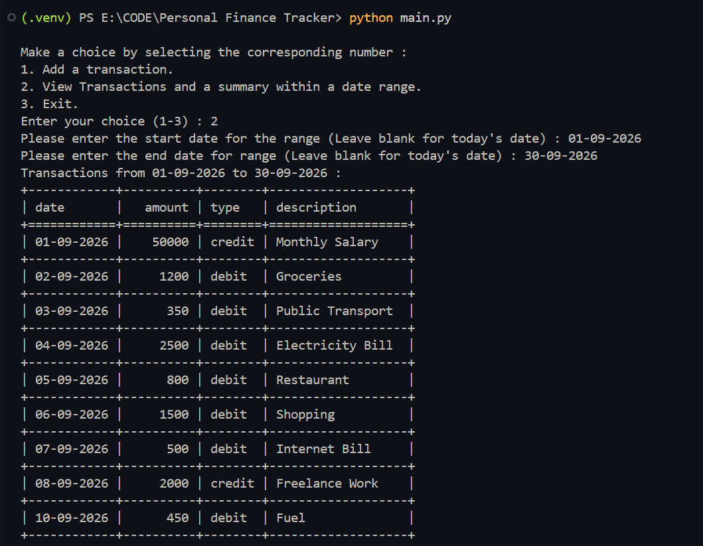
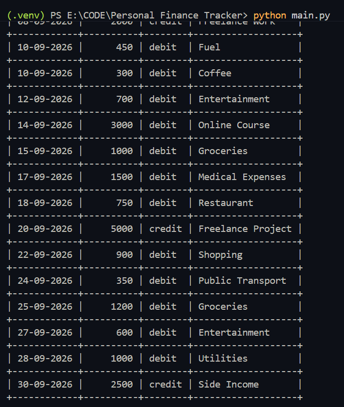
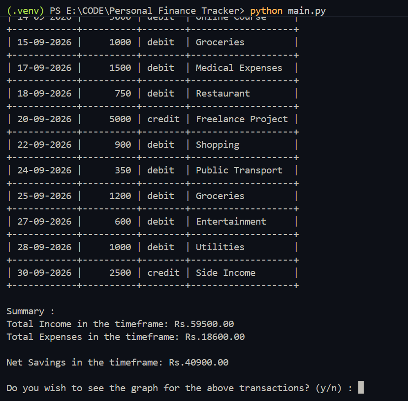
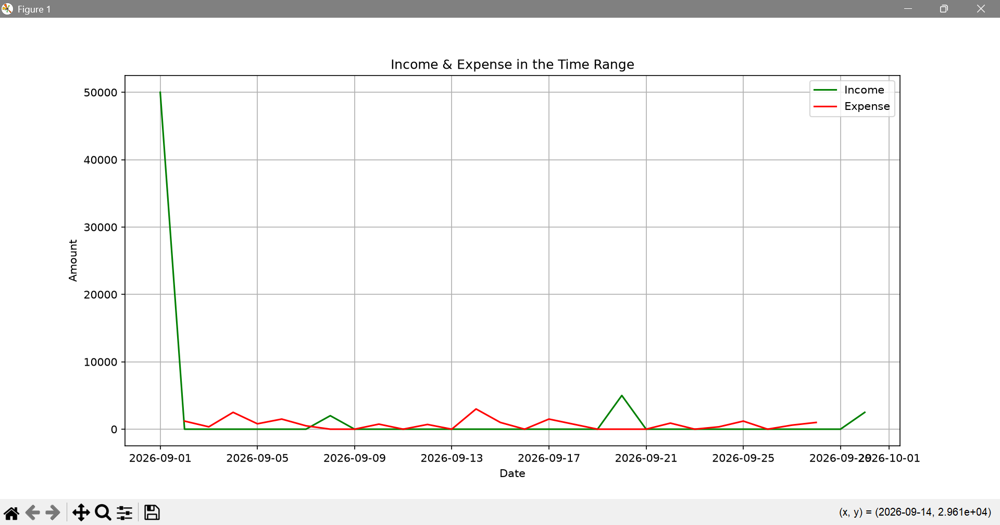

# Personal Finance Tracker

A simple command-line Personal Finance Tracker built with Python.

The application allows users to record credit and debit transactions, view transactions within a specific date range, calculate income, expenses and net savings, and visualize financial activity using a graph.

## Features

* Add new financial transactions
* Record transactions as **credit** or **debit**
* Store transaction data in a CSV file
* View transactions within a specified date range
* Calculate:

  * Total income
  * Total expenses
  * Net savings
* Display transactions in a formatted table
* Visualize income and expenses over time
* Validate transaction dates, amounts and transaction types

## Technologies Used

* **Python**
* **Pandas** — data handling and date-range filtering
* **Matplotlib** — data visualization
* **Tabulate** — formatted terminal output
* **CSV** — local transaction storage
* **Datetime** — date validation and processing

## Project Structure

```text
Personal Finance Tracker/
│
├── main.py
├── data_entry.py
├── .gitignore
└── README.md
```

### `main.py`

Contains the main application logic, including:

* CSV handling
* Adding transactions
* Retrieving transactions
* Calculating financial summaries
* Generating income and expense graphs
* Command-line menu

### `data_entry.py`

Contains functions responsible for collecting and validating user input:

* Transaction dates
* Transaction amounts
* Transaction types
* Transaction descriptions

## Transaction Format

Transactions are stored using the following structure:

```text
date, amount, type, description
```

Transaction types are:

* **credit** — money received
* **debit** — money spent

Example:

```text
01-09-2026,50000,credit,Monthly Salary
02-09-2026,1200,debit,Groceries
03-09-2026,350,debit,Public Transport
```

## Installation

### 1. Clone the repository

```bash
git clone YOUR_GITHUB_REPOSITORY_URL
```

### 2. Navigate to the project directory

```bash
cd Personal-Finance-Tracker
```

### 3. Create a virtual environment

```bash
python -m venv .venv
```

### 4. Activate the virtual environment

**Windows:**

```bash
.venv\Scripts\activate
```

**macOS/Linux:**

```bash
source .venv/bin/activate
```

### 5. Install the required packages

```bash
pip install pandas matplotlib tabulate
```

### 6. Run the application

```bash
python main.py
```

## Usage

When the application starts, the user is presented with three options:

```text
1. Add a transaction.
2. View Transactions and a summary within a date range.
3. Exit.
```

### Adding a transaction

Select option `1` and enter:

* Transaction date
* Amount
* Transaction type
* Description

The date must be entered in:

```text
dd-mm-yyyy
```

The date can also be left blank to use today's date.

### Viewing transactions

Select option `2` and provide a start and end date.

The application displays all transactions within that range and provides a summary:

```text
Summary:
Total Income in the timeframe: Rs.XXXXX.XX
Total Expenses in the timeframe: Rs.XXXXX.XX
Net Savings in the timeframe: Rs.XXXXX.XX
```

The application also provides an option to display a graph showing income and expenses over the selected period.

## Screenshots

### Adding a Transaction




### Transaction Summary





### Income & Expense Graph





## What I Learned

This project helped me practice:

* Python functions and modules
* Input validation
* Exception handling
* Working with CSV files
* Pandas DataFrames
* Date and time manipulation
* Filtering data using conditions
* Data aggregation and resampling
* Data visualization with Matplotlib
* Formatting terminal output with Tabulate
* Using Git and GitHub for version control


## Author

**Karan Sagar**

This project was created as part of my journey to strengthen my Python programming and software development skills.
